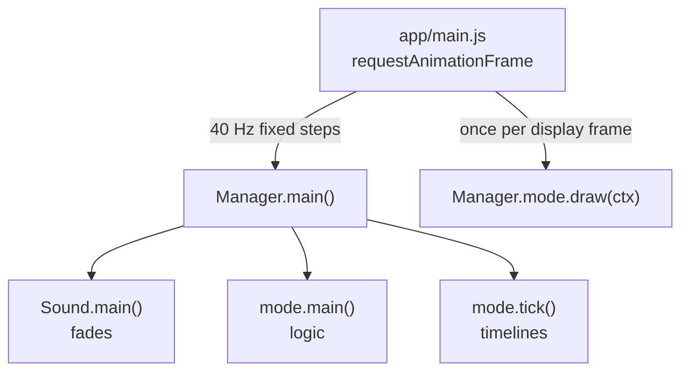
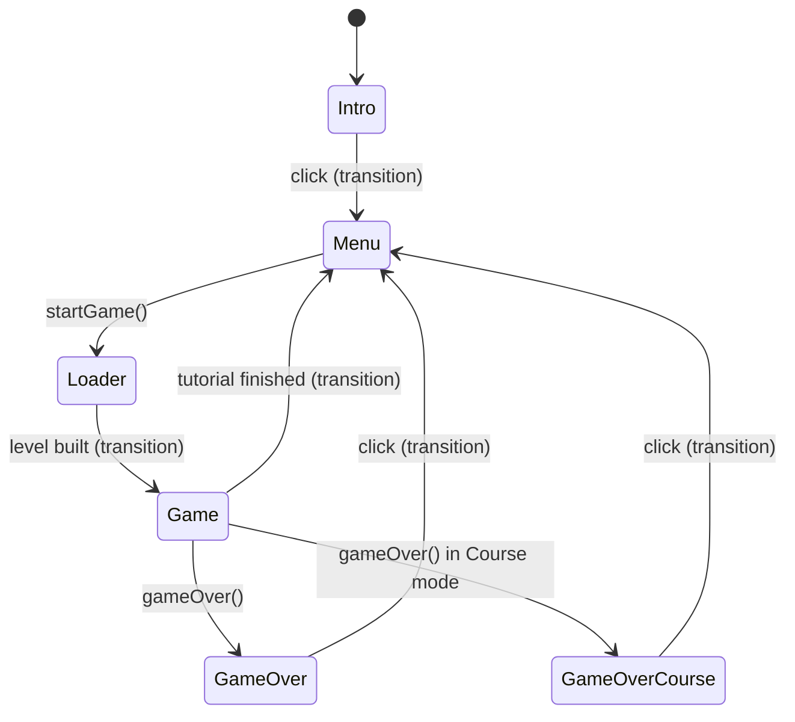
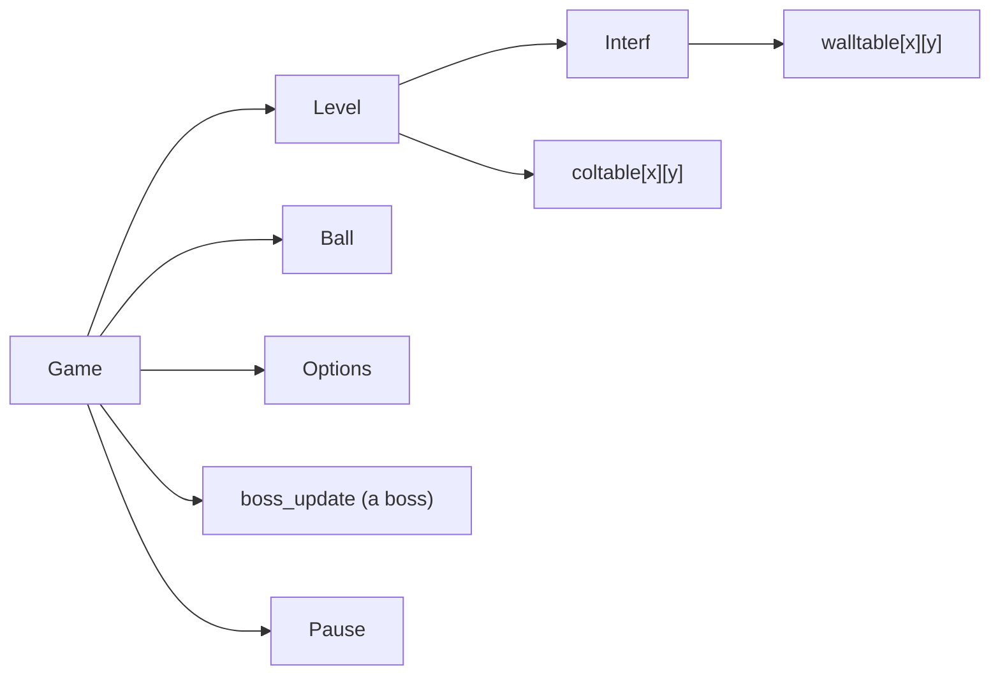

# MotionBall 2 HTML5: technical documentation

This document explains how the HTML5 port of MotionBall 2 is organized, how its parts work together, and where the tricky parts are. Read it before changing the code.

For how to play and what was ported, see [../README.md](../README.md). For how to replace the redrawn art with the original Flash symbols, see [../FLA_DECODING.md](../FLA_DECODING.md).

---

## 1. Principles

- **A port, not a rewrite.** The game logic is a close translation of the ActionScript 2 sources in `../mb2/*.as`, plus the OCaml level generator in `../mb2gen/*.ml`. Class names, method names (`on_update`, `change_room`, `col_test`…) and constants are kept, so any part of the port can be compared with the original line by line. This is also why the method names mix `snake_case` (from the AS code) and `camelCase` (new code).
- **No build, no dependency.** Plain JavaScript files, loaded by `index.html`. The game runs from any static web server, or straight from the disk.
- **No modules.** Browsers refuse ES modules on `file://`, so every file adds its content to a single global object, `MB2`. The files are wrapped in `(function () { ... })()` to keep their helpers private.
- **Flash emulation.** The original drove everything through MovieClips (timelines, frame labels, depths). The port keeps that model: a small `Clip` class (a MovieClip with a timeline) and a `DepthManager`. With them, code such as `clip.gotoAndPlay("hit")` or `if (clip.frame === 1)` ports unchanged.

---

## 2. Directory layout

```
html5/
├── index.html              the page ; loads the scripts in dependency order
├── README.md               user documentation
├── FLA_DECODING.md         how to get the real vector art from the .fla files
├── docs/ARCHITECTURE.md    this file
├── assets/
│   ├── img/                bitmaps extracted from mb2.fla
│   └── snd/                sounds (../sounds/*.wav + the ones extracted from mb2.fla)
├── tools/
│   ├── extract_fla.py      extracts assets/ from ../mb2.fla (Python + olefile + Pillow)
│   ├── build_levels.js     packs ../dungeon/*.txt into js/data/levels.js (Node)
│   └── test_levels.js      checks the level data layer (Node, no dependency)
└── js/
    ├── core/               namespace, constants, Flash-like runtime
    ├── data/               level format, decoding, random generation
    ├── audio/              sound mixer and game sounds
    ├── gfx/                bitmaps, drawing helpers, symbols (the graphics)
    ├── game/               the game : rooms, ball, collisions, interface
    ├── boss/               the three bosses and their powers
    ├── screens/            intro, menu, transition, pause, game over
    └── app/                save data, screen manager, input, main loop
```

### File by file

| File | Content | Original |
| --- | --- | --- |
| `core/mb2.js` | the `MB2` global namespace | |
| `core/const.js` | `MB2.Const` (sizes, modes, planes) and the enums `BallType`, `Bumper`, `Room`, `Path`, `DungeonObject`, `DungeonBonus` | `Const.as` |
| `core/std.js` | `MB2.Std` (frame timing, random), `random()`, `MB2.removeFrom`, `MB2.Tools` | `Std`, `Tools.as` |
| `core/clip.js` | `MB2.Clip` (a MovieClip), `MB2.SYMBOLS`, `MB2.drawTinted`, `MB2.frameHolder` | Flash |
| `core/depth_manager.js` | `MB2.DepthManager` (display planes) | `asml.DepthManager` |
| `core/keyboard.js` | `MB2.Key` (polled keyboard) | AS2 `Key` |
| `data/bitcodec.js` | `MB2.BitCodec` (the level data bit reader) | `ext.util.MTBitcodec` |
| `data/level_format.js` | `MB2.LevelFormat` : the level structure, decoding of the editor rooms | `LevelLoader.as` |
| `data/assemble.js` | `MB2.assembleDungeon` : hand-made dungeons | `mb2gen/assemble.ml` |
| `data/levels.js` | `MB2.LEVEL_FILES` (**generated**, do not edit) | `../dungeon/*.txt` |
| `data/generator/common.js` | `MB2.Gen` helpers, the bumper hitmaps (`bumpers.txt`) | `mb2gen/level.ml` |
| `data/generator/dungeon.js` | `MB2.Gen.Dungeon` : random 8 × 8 maps | `mb2gen/dungeon.ml` |
| `data/generator/rooms.js` | `MB2.Gen.Rooms` : random room contents | `mb2gen/level.ml` |
| `data/generator/challenge.js` | `MB2.generateChallenge`, `Gen.convertRoom` | `Level.make` |
| `data/generator/classic.js` | `MB2.ClassicDungeon` | `Level.make_classic` |
| `audio/sound_manager.js` | `MB2.SoundManager` (channels, fades ; Web Audio or `<audio>`), `MB2.SOUND_FILES` | `asml.SoundManager` |
| `audio/sound.js` | `MB2.Sound` : sound names, music, the in-game music mix | `Sound.as` |
| `gfx/assets.js` | `MB2.IMAGES`, `MB2.img`, `MB2.loadImages` | |
| `gfx/draw.js` | `MB2.G` (drawing helpers), `MB2.BALL_COLORS`, `MB2.Frames`, `MB2.FONT` | |
| `gfx/symbols/*.js` | the symbols (see §5) | the `.fla` library |
| `game/collide.js` | `MB2.Collide` : collision callbacks and item behaviours | `Collide.as` |
| `game/options.js` | `MB2.Options` : balls left, keys, map, radar, icons | `Options.as` |
| `game/ball.js` | `MB2.Ball` : controls, physics, holes, death | `Ball.as` |
| `game/interf.js` | `MB2.Interf` : doors, walls and holes display, room scrolling, counter | `Interf.as` |
| `game/level.js` | `MB2.Level` : building rooms, the collision table, `col_test` | `Level.as` |
| `game/game.js` | `MB2.Game` : the play session | `Game.as` |
| `boss/common.js` | `MB2.BossTools` | |
| `boss/octopus.js` | `MB2.Boss` (Challenge) | `Boss.as` |
| `boss/serpent.js` | `MB2.BossSerpent` (adventures 1-4) | `BossSerpent.as` |
| `boss/tourneboule.js` | `MB2.BossTB` (adventure 5) | `BossTB.as` |
| `boss/powers/*.js` | `BossPowEau`, `BossPowFeu`, `BossPowTerre`, `BossPowVent` | `BossPow*.as` |
| `screens/common.js` | `MB2.ScreenGfx`, `MB2.PopupFX`, `MB2.isValidateKey` | `asml.PopupFX` |
| `screens/*.js` | `Text`, `Intro`, `Menu`, `Transition`, `Pause`, `GameOver`, `GameOverCourse` | same names |
| `app/save.js` | `MB2.newCard`, `MB2.Prefs`, `MB2.Client` (localStorage) | `Card.as`, `Prefs.as`, `Client.as` |
| `app/titems.js` | `MB2.TItems` (trophies) | `TItems.as` |
| `app/manager.js` | `MB2.Manager` : screens and game life cycle | `Manager.as`, `Loader.as` |
| `app/input.js` | `MB2.Input` (mouse, keys, touch), `MB2.Touch` | |
| `app/main.js` | `MB2.start` : canvas, loading, main loop | |

Not ported : `Editor.as` (the level editor) and `Aide.as` (a help screen the menu never shows).

### Load order

`index.html` loads the layers in this order: `core` → `data` → `audio` → `gfx` → `game` → `boss` → `screens` → `app`, then calls `MB2.start()`.

A file may only use the files above it **while it loads**, for example by reading `MB2.Const` in a top-level `const`. Inside functions it can use anything, because they only run once everything is loaded. So `game/collide.js` can call `new MB2.Boss(...)`, even though `boss/` loads after it.

---

## 3. Runtime overview



### 3.1 The main loop (`app/main.js`)

The original ran at 40 frames per second, and every movement is expressed per frame. The loop accumulates real time and runs as many fixed 1/40 s logic steps as needed (`Manager.main()`), then draws once. After a long pause (a background tab, for example) it runs at most 6 steps and drops the rest of the delay instead of fast-forwarding.

`MB2.Std.tmod` (the speed factor of the original) therefore stays at 1 and `Std.deltaT` at 1/40. The ported code still multiplies by them, which keeps it identical to the original.

### 3.2 Screens and the Manager (`app/manager.js`)

The Manager holds the current screen in `MB2.Manager.mode`. A screen is any object with:

| Method | Called |
| --- | --- |
| `main()` | every logic step |
| `tick()` (optional) | after `main()` : advances the clip timelines |
| `draw(ctx)` | every display frame |
| `destroy()` | when the screen is left |
| `onMouseMove(x, y)`, `onMouseDown(x, y)`, `onKey(code)` (optional) | input events (see §9) |



**Transitions (tricky).** `setNextMode(i)` wraps the current screen in a `Transition`, a rotating shape that closes on the old screen:

1. When the shape is closed, the transition destroys the old screen and asks `Manager.nextMode()` to create the new one. `next_mode` says which: 0 menu, 2 error, 3 game.
2. When the shape is fully open again, the transition calls `Manager.switchMode()`, and the new screen becomes `Manager.mode`.

`forceNextMode()` can change the target of a running transition.

`GameOver` and `GameOverCourse` are not reached through a transition: they wrap the `Game`. They keep running and drawing it (it is frozen by `game_over_flag`), and draw the panel on top.

---

## 4. The Flash emulation (`core/`)

### 4.1 Clips and symbols

A **symbol** is a plain object registered in `MB2.SYMBOLS` under its Flash linkage name. It describes a library item of the `.fla`:

```js
MB2.SYMBOLS.bnormal = {
	w: 48, h: 48,                          // size (see 4.3)
	frames: 10,                            // timeline length
	labels: { hit: 2 },                    // gotoAndPlay("hit") -> frame 2
	actions: {                             // frame scripts
		1: MB2.Frames.stop,                //   frame 1 : stop();
		10: MB2.Frames.goto(1)             //   frame 10 : gotoAndStop(1);
	},
	init(clip) { },                        // creates named children, e.g. clip.aig
	update(clip) { },                      // every frame, before the timeline advances
	draw(ctx, clip) { }                    // draws clip.frame around (0, 0)
};
```

A **clip** (`new MB2.Clip("bnormal")`) is an instance of a symbol. It has the MovieClip properties, in Flash units:
- `x`, `y`;
- `rotation`, in degrees;
- `xscale`, `yscale` and `alpha`, in percents;
- `visible`;
- `frame`, which is `_currentframe` and starts at 1.

It also has the timeline methods `gotoAndStop`, `gotoAndPlay`, `play`, `stop`, `nextFrame` and `removeMovieClip`. A playing timeline advances one frame per logic step, and loops at its end like in Flash.

Named children that only need a frame, such as `clip.ball.gotoAndStop(3)`, are faked with `MB2.frameHolder()`. The symbol's `draw` reads them.

Two extras replace Flash features:
- **`clip.mask = fn(ctx)`** sets a clipping region, in parent coordinates. It replaces `setMask`, used for the ball falling into holes.
- **`clip.tint = { r, g, b, k }`** is an additive colour, replacing `Color.setTransform`. It is used for the red flashes of the bosses. `MB2.drawTinted` draws the symbol in an offscreen canvas and paints the colour over its own pixels only.

### 4.2 Depths

`MB2.DepthManager` holds the clips of a screen in numbered **planes**, the `*_PLAN` constants of `MB2.Const`. From back to front: background, shades, border and doors, holes, pastilles, ball, bumpers, effects, bosses, icons.

Planes are drawn in order, and inside a plane the clips are drawn in creation order. Consequences:
- The bumpers are drawn above the ball (the ball can't overlap them).
- The border is drawn above the doors, and has gaps where the doors are.
- The snake boss adds its parts from the tail so that the head is drawn last.

`dmanager.tick()` advances all the timelines and forgets the removed clips. The game doesn't tick while paused, so every animation freezes.

### 4.3 Sizes and positions (important)

Bumpers are placed from **cell** coordinates: the room is 152 × 102 cells of 4 × 4 pixels. `Tools.mc_size(clip)` turns the symbol's `w` / `h` into an even number of cells, and `Tools.set_mcpos(clip, p)` centers the clip on the rectangle whose top-left cell is `p`.

A symbol's `w` / `h` must therefore stay consistent with its **hitmap** (§6.2). For example, `bnormal` is 48 px wide, which gives 12 cells, and its hitmap is 12 × 12. Changing a size moves the bumper and breaks the collisions.

---

## 5. Graphics (`gfx/`)

- `gfx/assets.js` loads the bitmaps into `MB2.img`, by file name without the extension.
- `gfx/draw.js` holds the drawing helpers (`MB2.G`):
  - `img`: a bitmap, centered by default;
  - `ball`: a shaded sphere;
  - `shine`: a sphere's highlight;
  - `rrect`: a rounded rectangle path;
  - `text`: text with an outline, multi-line;
  - `cache`: an offscreen canvas, drawn once;
  - `pulse`: the "boing" of a bumper hit;
  - `sparkle`: the burst of a collected pastille.

  It also holds the ball colours (`MB2.BALL_COLORS`) and the frame script shortcuts (`MB2.Frames`).
- `gfx/symbols/*.js` hold the symbols, grouped by theme:

| File | Symbols |
| --- | --- |
| `room.js` | `empty`, `background`, `border`, `door`, `ground` (holes), `holes`, `shades` |
| `bumpers.js` | `ombre` (shadows), `bnormal`, `btime`, `bdeath`, `bmagnet`, `bshadow`, `wall`, `wallpart`, `interred`, `interblue`, `interupt`, `zapper`, `checkpoint`, `zaplines`, `flashLine`, `bteleport` |
| `items.js` | `red`, `blue`, `hit`, `exit`, `maskHole`, `itembox`, `ballbox` |
| `ball.js` | `shadow`, `marble` |
| `hud.js` | `time counter`, `ball icon`, `icon grelot` |
| `boss_octopus.js` | `boss`, `boss shade`, `boss tir`, `bossParticule` |
| `boss_snake.js` | `snake`, `snakePart`, `logoBg` |
| `boss_tourneboule.js` | `tourneboule`, `TBShadow`, `forceBubble`, `TBVanish`, `TBSpawn` |
| `boss_effects.js` | `dalle`, `FXDalleCut`, `FXWater`, `FXWaterParticule`, `FXWaterQueue`, `FXFire`, `FXbourgeon`, `FXLiane`, `FXWind` |

The bitmaps are the originals. The vector symbols of the `.fla` couldn't be decoded, so their `draw` functions are redrawn approximations. [FLA_DECODING.md](../FLA_DECODING.md) lists each symbol with the contract the game code relies on (labels, children, sizes), and explains how to replace them with the real art.

The screens (`screens/`) draw directly with the canvas API rather than through symbols. Their shared helpers are in `screens/common.js`.

**Rendering pipeline.** `app/main.js` sets a canvas transform that maps the 610 × 410 game coordinates to the canvas size (window size × `devicePixelRatio`). All drawing code uses game coordinates.

---

## 6. The game (`game/`)

### 6.1 Objects of a game



- **`Game`** (`game/game.js`) is the session. `main()` does one frame:
  1. the room scrolling, or the pause, if active (and nothing else);
  2. the timer;
  3. the `updates` of the room (magnets, clocks, teleports…);
  4. the falling / dying ball (only the boss keeps moving), or else:
     - the keys (Space changes the ball, Escape pauses);
     - the ball;
     - the boss;
     - the pastilles;
     - the room exits.
- **`Level`** (`game/level.js`) holds the dungeon data and the current room (`pos_x`, `pos_y`). It builds the room objects from the level data (`gen_room`, `gen_bumper`) and owns the **collision table** and `col_test`.
- **`Interf`** (`game/interf.js`) handles the room display that isn't a bumper:
  - backgrounds, border and doors (4 for the room, 4 more for the next room while scrolling);
  - the `walltable` of blocks and holes, and their drawing (`update_walls`);
  - the scrolling between rooms;
  - the time counter.
- **`Ball`** (`game/ball.js`) handles:
  - the controls, and the acceleration and inertia of each ball type;
  - the movement in steps of at most one cell;
  - the holes (`hole_test`) and the blue ball's jump;
  - the death animation (`update_hole`) and the respawn (`kill`).
- **`Options`** (`game/options.js`) is the inventory: balls left per type, keys, map, radar, and their icons.
- **`Collide`** (`game/collide.js`) is a static object with the collision callbacks (`*_on_hit`) and the per-frame behaviours (`*_on_update`) of all the items.

### 6.2 Collisions (tricky)

The room is a grid of 152 × 102 cells of 4 pixels: `level.coltable[x][y]`. A cell is empty, or references the **collision object** occupying it:

```js
{
	on_hit(game, obj, px, py),   // effect of the contact
	hit_coef,                    // bounce speed = ball speed x hit_coef ...
	hit_min,                     // ... but at least hit_min
	is_event                     // true : not solid, only triggers on_hit (zapper lines)
}
```

For a bumper, the object is its level item itself (`{ btype, x, y }`), completed by `Level.gen_bumper`. The cells are filled with the bumper's **hitmap**, a table of booleans indexed by `btype - 1`:
- normal, time, death, magnet, shadow and block come from `../mb2gen/bumpers.txt`, the shapes exported by the level editor, decoded in `data/generator/common.js`;
- the item box, switch and zapper are circles (`Collide.circle_hitmap`), because the original computed them with `hitTest` on the symbols.

The border fills the edges of the grid, and each door fills its part of the border. An open door is empty, with a thin "no recal" border around it.

**`Level.col_test(x, y)`** tests 16 points on the circle of the ball (radius 8):
- `is_event` cells only call their `on_hit`;
- when two or more points touch solid cells, the average angle of the hit points gives the collision normal. The ball bounces (reflection plus a tiny random angle) with speed `max(ball speed × hit_coef, hit_min)`, and is pushed out.

A single hit point is ignored (grazing), and so is a contact where the ball is moving away. `Ball.update` moves the ball in steps of at most one cell and stops at the first collision. After 20 frames stuck, `Ball.recall` searches a free position around.

The pastilles are not in the collision table. `Game.collect_bonus` takes them by distance.

### 6.3 Walls and holes

Green blocks (`Bumper.WALL`) and holes (`Bumper.HOLE`) live on a coarser grid of 10 × 10 cells, `interf.walltable`. The room is 14 × 9 of those cells.
- **Blocks** are also bumpers, so they are in the collision table.
- **Holes** are only in the walltable. `Ball.hole_test` checks it at each step of the movement: the ball is pulled to the center and falls once far enough from the edges. The blue ball jumps over holes instead.

`Interf.update_walls` recomputes:
- the frame of each block, from its neighbours, so that blocks merge;
- the hole rectangles, where the `ground` symbol shows the `bgHole` bitmap;
- the drop shadows.

### 6.4 Rooms, doors and scrolling

Each room has 4 exits, `room.paths[d].ptype`, with d = 0 left, 1 right, 2 up, 3 down (see `MB2.Path`):

| Value | Meaning |
| --- | --- |
| `DOOR` (0) | a door, opened when all the red pastilles are collected (or with a key) |
| `WALL` (1) | no exit |
| `INVISIBLE` (2) | an open exit that looks like a wall |
| `SPECIAL` (3) | Challenge: a door behind which a ball is needed. Other modes: a one-way door |
| `OPEN` (-1) | a door that was opened (set while playing) |
| `ONE_WAY` (-2) | a one-way door that was crossed (set while playing) |

The game modifies the level data while playing: doors stay open, destroyed blocks get `btype = NONE`, and taken items get `rdata = -1`. That's why the Manager builds a fresh level for each game. The Course mode resets the other rooms at each lap (`Game.course_turn_done`).

When the ball leaves the room (`Game.check_exits`), `Level.change_room` removes the room objects and `Interf.change_room` starts a 20-frame scrolling. Only the backgrounds, borders, doors and ball move. At the end, `Game.next_room` builds the new room, and the ball's position becomes the respawn point.

**Classique mode (tricky).** Rooms have no exits. Falling through the open hatch (`Ball.update_hole`) increments `pos_x`, picks a random `pos_y - 1`, and puts the ball one room lower: the normal "leave by the bottom" code then scrolls down into the chosen room. `Level.prepare_room` makes the Classique dungeon generate its columns on demand (`ClassicDungeon.ensure`).

### 6.5 Time and score

`game.curtime` is the remaining time in milliseconds, except in Course mode, where it counts up in seconds. `Game.calcScore` and `GameOver.onScore` explain the score encoding:
- Challenge / Aventure: rooms visited in percent, minus 1, plus 100 × the remaining time in tenths of seconds after a victory;
- Classique: the level reached;
- Course: the time, in hundredths of seconds.

---

## 7. The bosses (`boss/`)

A boss is created by `Collide.boss_room_on_update` when the ball enters the boss room, and stored in `game.boss_update`. The game calls `boss.on_update()` every frame (also while the ball is dying) and `boss.onPause(flag)`. A boss ends the game with `game.gameOver(Const.CAUSE_WINS)`. Each file starts with a comment explaining the fight.

| Boss | Mode | How to beat it |
| --- | --- | --- |
| `Boss` (octopus) | Challenge | Send its thrown eye back into it, 4 times. |
| `BossSerpent` | Aventure 1-4 (element = dungeon + 1) | Hit its head from the front while it is calm: it loses a ring. It dies after a berserk phase. |
| `BossTB` (Tourneboule) | Aventure 5 | Touch it while it stands (after its shield pops). It dies after 20 hits. |

Powers (`boss/powers/*.js`) are small objects with `update()` and `destroy()`. They remove themselves from `boss.powers` when they end. The final boss casts all four, stronger (`boss.tb`).

**Final boss (tricky).** Its behaviour was driven by the timeline of its Flash symbol: the frame scripts called `animDone()` and `kataDone()`. The rebuilt timeline in `gfx/symbols/boss_tourneboule.js` calls the same callbacks in the same order. Change both files together.

---

## 8. Level data (`data/`)

All levels use the structure described in `data/level_format.js`:

```
level = { width, height, start_x, start_y, dungeon[x][y] }
room  = { rtype, rdata, paths[4] = { ptype, pdata }, bdata = [{ btype, x, y }] }
```

It is what `mb2/LevelLoader.as` decoded from the `.dat` files made by the OCaml tool `mb2gen`. The port builds it directly:

- **Hand-made dungeons** (tutorial, 5 adventures, 7 courses): `tools/build_levels.js` packs `../dungeon/*.txt` into `js/data/levels.js`. At game start, `MB2.assembleDungeon` (a port of `assemble.ml`) decodes it. Each room line of those files comes from the level editor and is encoded with the **BitCodec**:
  - 6 bits per character;
  - most significant bit first;
  - alphabet `a-zA-Z0-9-_`.

  The alphabet was recovered by trying every plausible ordering on the 302 rooms of the game.
- **Random dungeons** (Challenge, Classique): the OCaml generator is ported in `data/generator/`. It keeps the OCaml design: every step may `throw new Gen.Retry(reason)`, and the caller retries (`Gen.retry`). The random numbers differ from OCaml's, so the levels differ from the original `.dat` files, but they follow the same rules:
  - `dungeon.js` builds the 8 × 8 map:
    - carve rooms, add extra openings and walls;
    - place the 4 balls in dead ends, and the doors and rooms that need them;
    - check the difficulty;
    - place the bonuses in the remaining dead ends.
  - `rooms.js` fills a room:
    - doors, separating walls and the bumpers, more dangerous as the room gets farther from the start;
    - then a flood fill (`computeRoomTbl`) finds the reachable cells, so that pastilles and exits are always reachable.

    **Tricky**: that flood fill must keep the OCaml recursion order (explicit stack), because flags accumulate along the way.
  - `challenge.js` converts the result to the level format.
  - `classic.js` generates the Classique columns on demand.

`node tools/test_levels.js` checks all this without a browser.

---

## 9. Input (`app/input.js`, `core/keyboard.js`)

- **The game polls the keyboard**: `MB2.Key.isDown(MB2.Key.LEFT)`, like the AS2 `Key` object. WASD keys (by physical position, so also ZQSD) are mapped to the arrows, and P to Escape. `MB2.Touch.dx` / `dy` (-1..1) add the touch joystick to the arrows (`Ball.update`).
- **The screens receive events** in game coordinates: `onMouseMove`, `onMouseDown`, `onKey`. During a transition nobody receives them. During the pause, the `Pause` receives them instead of the `Game`.
- **Touch**: on the game, a drag works as a joystick; on the other screens, a tap is a click. The two buttons below the canvas act as Space and Escape.

---

## 10. Audio (`audio/`)

`MB2.SoundManager` mixes 8 channels:

| Channel | Use |
| --- | --- |
| 0 | sound effects |
| 1-2 | music (cross-faded when the music changes) |
| 3-7 | the in-game music |

It uses Web Audio when the page is served over http(s): the sounds are decoded at load time and the loops start in sync. On `file://` it falls back to `<audio>` elements.

**The in-game music (tricky).** 5 loops of the same length play together, in sync, on channels 3-7, but only one is audible. Each new ball colour found cross-fades to the next, richer loop (`Sound.nextMix`). `fadeMix` cross-fades the current loop into the boss or menu music.

Browsers only allow sound after a user action: `SoundManager.resume()` is called on every click, key or touch.

---

## 11. Save data (`app/save.js`, `app/titems.js`)

The Frutiparc client ("Frusion") stored two slots on a server. The port keeps them in `localStorage`, under the key `motionball2.save`:
- **slot 0**, the card (`MB2.newCard()`): unlocked modes, courses and dungeons, records, TItems;
- **slot 1**, the preferences (music, sounds).

Field names keep the original `$` prefix. `Client.connect` fills the fields that older saves miss.

The online rankings are gone: `GameOver.onScore` receives 0 as positions, and the Challenge keeps a local best score.

---

## 12. Conventions

- **Names.** Ported code keeps the original names (`gen_room`, `bonus_reds`, `curtime`, `grelot_count`…) so it can be compared with `../mb2/*.as`. New code uses `camelCase`.
- **Units.**
  - Positions are in pixels, except the level data, the collision table and bumper positions, which are in cells (4 px).
  - Clip rotations are in degrees, maths in radians.
  - Scales and alphas are in percents.
  - Times are in frames (40 per second), milliseconds (`curtime`) or seconds (`deltaT`): check the comment of the variable.
- **Enums.** Use the enums of `core/const.js` (`MB2.Bumper.WALL`, `MB2.Path.OPEN`, `MB2.BallType.METAL`…) rather than raw numbers.
- **Style.** Tabs, one statement per line, braces optional for single-line `if` / `for` bodies, blank lines between logical steps. Every file starts with a comment telling what it is and what it ports.
- **Comments.** Explain why, and anything surprising. `(sic ...)` marks an oddity of the original kept on purpose. `TRICKY` marks the places to read carefully before changing them.

---

## 13. Common tasks

**Add or change a symbol.** Edit its entry in `gfx/symbols/`. Keep its contract: labels, children, `w`/`h` (§4.3). To replace all the drawings with the real art, follow [FLA_DECODING.md](../FLA_DECODING.md).

**Add a bumper type:**
1. Add it to `MB2.Bumper` (`core/const.js`). The level data stores types on 4 bits, so at most 15.
2. Add its definition in `BUMPER_DEFS` (`game/level.js`) and any setup in `Level.gen_bumper`.
3. Add its hitmap in `Collide.init` and its callbacks in `game/collide.js`.
4. Create its symbol in `gfx/symbols/bumpers.js`.
5. If the random levels should use it, add it to `data/generator/rooms.js`.

**Add a sound.** Put the file in `assets/snd/`, map a name to it in `MB2.SOUND_FILES` (`audio/sound_manager.js`), and add a constant in `MB2.Sound`.

**Change the hand-made levels.** Edit `../dungeon/*.txt` (see `../mb2gen/gen_help.html`), then run `node tools/build_levels.js`.

**Re-extract the assets.** Run `pip install olefile pillow`, then `python3 tools/extract_fla.py`.

**Test.** There is no automated test of the game itself.
1. Run `node tools/test_levels.js` for the level data.
2. Play every mode, including a boss fight and a Classique hatch.
3. Check both `http://` and `file://`.
